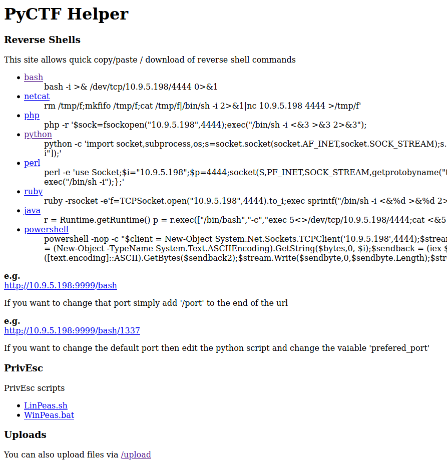

# pyctf-helper
A quick and nasty flesk application to help with CTF's

## Install
1. Clone repo / download release
2. Change into directory
3. Install requirements
```bash
pip3 install -r requirements.txt
```
4. Execute `run.sh`
```bash
./run.sh
 * Serving Flask app "pyctf-helper" (lazy loading)
 * Environment: development
 * Debug mode: on
 * Running on http://0.0.0.0:9999/ (Press CTRL+C to quit)
 * Restarting with stat
 * Debugger is active!
 * Debugger PIN: 292-264-105
```
5. Access locally via [http://127.0.0.1:9999](http://127.0.0.1:9999) or remotely via http://ipaddress:9999


## Uploading files
By default `run.sh` will create a `uploads` directory in the current working directory. Files uploaded via `/upload` will be prepended with the clients IP Address.

### Changing Upload directory
To change the upload directory you will need to edit `pyctf-helper.py` and change 

> uploaddir = 'uploads/'

## LinPeas / WinPeas

PEASS (PEASS - Privilege Escalation Awesome Scripts SUITE) are 2 great scripts for CTF's and Pen Testing by [Carlospolop](https://github.com/carlospolop), they can be dowloaded from [https://github.com/carlospolop/privilege-escalation-awesome-scripts-suite](https://github.com/carlospolop/privilege-escalation-awesome-scripts-suite)

If either linpeas.sh or winpeas.sh does not exist under the static directory or are older than 7 days then you will be prompted to download/update

```
LinPeas is older than 7 days or does not exist, update LinPeas? [y/n]: n
WinPeas is older than 7 days or does not exist, update WinPeas? [y/n]: n
```
## Change Listen Address / Port
To change the listen address or port that this application runs on change the last line of `run.sh`

> flask run --host=0.0.0.0 --port=9999

## Changeing the default Local Port
The default local port to connect back to is set to `4444` as this is used in many examples online ( thanks to metasploit ), if you wish to change this then edit `pyctf-helper.py` and change 

> prefered_port = '4444'
